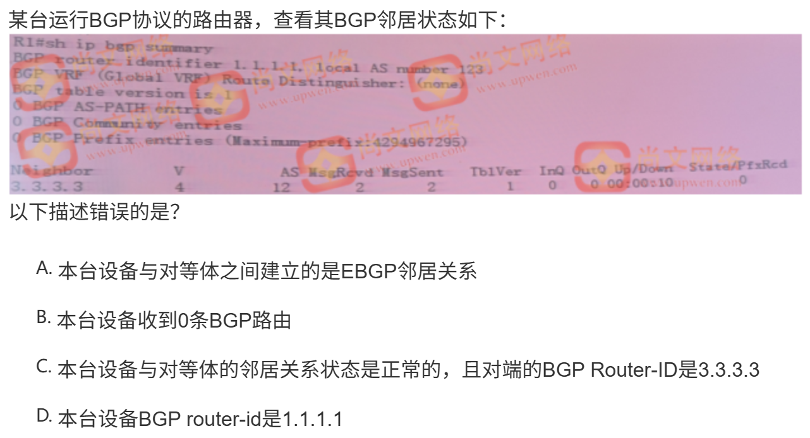

下列关于L2TP VPN的说法中错误的是? CD
A.L2TP可以对PPP数据帧以及IP报文进行封装
B.L2TP承载于UDP之上
C.L2TP协议承载于TCP之上
D.L2TP协议具有加密和可靠性验证的机制

配置静态路由时，使用 next-hop address 和 interface 两种方式的管理距离值分别是()B
A.1 0
B.1 1
C.0 0
D.0 1

```
S     192.168.20.0/24 is directly connected, GigabitEthernet 0/1
                      [1/0] via 10.0.25.1, GigabitEthernet 0/1
```

某客户希望路由器接口上配置1秒钟发送1个DLDP探测报文进行链路检测，正确的配置命令是C
A. dldp 1.1.1.1 interval 10
B. dldp 1.1.1.1 interval 1
C. dldp 1.1.1.1 interval 100
D. dldp 1.1.1.1 interval 1000

在 NFPP 工作过程使用的机制有()【选四项) ABCD
A. 硬件过滤非法数据
B.使用 CPP 对数据进行分类
C.对报文进行检测和限速
D.监控后的数据进行分类和集中限速
E.数据按最长掩码匹配的顺序优先转发精确数据流

14、K:关于锐捷交换机address-bind功能，以下选项中描述错误的是() D
A.当配置为address-bind ipv6-mode 兼容模式后，必须同时提供设备的IPv4地址和MAC地址，才能让ipv4和ipv6报文通过
B.配置address-bind 192.168.5.1 00d0 f800 0001后，需要在配置address-bind install才能令功能生效
C.对于上联到网关的接口需要关闭address-bind功能，需要在接口模式下配置address-bind disable命令
D. address-bind ipv6-mode的宽松模式指的是允许任意ipv6报文通过

IPv6 模式 
- 严格：需绑定 IPv6+MAC；
- 兼容：需绑定 IPv4+MAC（IPv6 关联 MAC）；
- 宽松：MAC 必须绑定（IPv6 不限）

15、(K单选)关于锐捷的POE交换机,下列说法正确的是()C   -》B
A.POE交换机的端口只要以Linkup就立即向对端设备提供电力输出
B.POE交换机面板上的POE模式按钮足用来开启设备POE功能的开关
C.POE交换机在给AP供电时,将接口shutdown不影响供电功能
D.POE交换机可以通过poe mode energy-saving命令,将交换机的供电模式切换为节能模式，切换过程对于POE供电无任何影响

23、在一个运行OSPF的自治系统之内() BD
A.非骨干区域自身也必须是连通的
B.骨干区域自身也必须是连通的
C.必须存在一个骨干区域( 区域号为0)
D.非骨干区域与骨干区域必须直接相连或逻辑上相连


B--》C

29、(K多选)以下关于NAT说法正确的是( ) AB
A.NAT的地址池可以与出接口地址在不同网段
B.多出口NAT的地址泄中每个地址段都需要和outside口对应
C.NAT与策略路由不能同时配置
D.多出口NAT的地址池中每个地址段都需要与inside口对应

35、关于在交换机ctrl层维护，下列说法正确的是()。AD
A.查看文件使用dir，更改文件名使用rename
B.用“?”来获取命令提示和帮助
C.升级主程序的命令格式为:tftp电脑ip设备ip文件名-main
D.加载主程序用load-main

51、关于在交换机ctr层维护，下列说法正确的是()BD
A.用?来获取命令提示和帮助
B.查看文件使用dir，更改文件名使用rename
C.升级主程序的命令格式为，tftp电脑ip设备ip文件名-main
D.加载主程序用load-main

42、相对STP，RSTP定义了两种不同的端口角色，对此说法正确的是() ABCD--》ABC
A.替代端口(alternate port)是根端口的备份
B.备份端口(backup port)是指定端口的备份
C.替代端口和备份端口相当于STP中被b1ock端口
D.备份端口是因为学习到了自己发出的BPDU而被阻塞的端口，它提供了从根桥到达相应链路的另一条备份路径

43、下列关于锐捷交换机在VSU功能方面,正确的是()C
A.VSU环境中，在主设备上执行reload的命令，主设备会发生重启,但从设备不会,此时从设备就会接替成为主设备
B.2台打算组建VSU的设备,若配置的switch id一致,可能导致VSL链路无法UP
C.做基于聚合口的双主机检测，VSU的聚合口对端的设备，除了需要支持聚合之外,不要其他特别功能
D.VSU的备设备和候选设备都无法通过session device的命令来管理,只能Console口接入管理

46、下列哪些是VSU技术优势( ABCD
A.网络协议热备
B.跨机箱链路聚合
C.跨机箱管理板冗余
D.VSL端口冗余备份

ICMPv6报文中,Type值为1的意义是什么? D
A. 请求超时
B.该报文是ICMPv6重定向报文
C.数据包过长
D.目的地不可达

52、在锐捷交换机上配置镜像，需要将Gi0/1接口的入向流量镜像到Gi0/2接口上，且Gi0/2接口依然能正常转发数据，应该如何配 D
置()。
A. Ruijie(config)#monitor session 1 source interface Gi0/1 tx
   Ruijie(config)#monitor session 1 destination interface Gi0/2 switch
B. Ruijie(config)#monitor session 1 source interface Gi0/1 both 
   Ruijie(config)#monitor session 1 destination interface Gi0/2
C. Ruijie(config)#monitor session 1 source interface Gi0/1 both
   Ruijile(config)#monitor session 1 destination interface Gi0/2 switch 
D. Ruijie(config)#monitor session 1 source interface Gi0/1 rx
   Ruijie(config)#fmonitor session1destination interface Gi0/2 switch

54、下列关于ARP-Check功能的说法中正确的是? B
A.SPAN的目的端口可以配置ARP-Check功能
B.ARP-Check和DAI在功能上完全一致，区别在于ARP-Check作用在端口，DAI作用在VLAN
C.ARP-Check支持仅IP检测、仅MAC检测和IP+MAC地址检测三种模式
D.DHCPSnooping功能的信任端口下可以配置ARP-Check功能

56、下列关于IPSec的两种封装模式,下列说法中正确的是 ACD
A.这两种封装模式分别是传输模式禾和隧道模式
B.隧道模式通常用于主机和主机之间的通信
C.传输模式不会改变原有的IP包头
D.隧道模式会新增IP头部
E.传输模式会改变原有的IP包头

IPV6的地址分配有无状态自动获取和DHCP自动获取2种方式，根据下述描述选择描述不合适的选项()。C
A.无状态自动分配地址方式、是根据终端的MAC地址生成IPv6地址
B.DHCPv6客户端向所有DHCPv6服务器和终端连接的网关发送目C的地址为FE02:1:2
C.2种方式都需要配置DHCP地址池进行分配地址，如果不正确配置DHCP，终端可能无法正常打开网页
D.接口启用IPV6并使能RA之后，默认采用的分配方式是无状态自动分配方式

59、以下关于L2TPVPN描述错误的是?() B
A.L2TP协议只能对PPP数据帧进行封装
B.L2TP协议自身具备可靠性验证功能
C.L2TP协议自身不提供数据加密功能
D.L2TP协议使用UDP1701端口

60、T:以下哪些设备可能干扰WLAN网络的工作()。ABCDE -->ABD
A.无线摄像头
B.蓝牙耳机
C.电冰箱
D.微波炉
E.收音机

64、关于全局地址绑定功能,下列说法中错误的是() D
A.配置了全局地址绑定的交换机，可以通过例外端口的配置使得该接口下接收的数据包不受绑定条目的限制
B.配置全局地址绑定条目后。需要使用address-bindinstall命令使其生效
C.默认配置下，如果有报文被全局地址绑定条目过滤,设备不会显示相关的log
D.默认配置下，如果有报文被全局地址绑定条目过滤,设备会显示相关的log

以下关于RIPng协议描述错误的是? B
A.使用UDP的521球端口收发报文
B.邻居每30s周期性发送request报文
C.使用组播地址FF02::9
D.支持水平分削、毒性逆转

关于锐捷路由器rate-control和rate-limit功能说法正确的是()CD
A.rate-fimit功能可以用于给ip报文的DSCP打标
B.rate-control可以用于给IP报文的DSCP打标签
C.rate-control是对ACI里的一个用户做带宽和会话数限制
D.rate-fimit是以ACL或接口一个组，限定一个总体的带宽

PPP帧被添加L2TP报头进行封装时，会被标以正确的TunnelID和Session ID，以标识其隧道和会话属性。该L2TP报头重的TunnelID由()分配,SessionID由()分配。 B-->C
A.对端LNS，本端LAC
B.对端LNS,对端LNS
C.本端LAC，本端LAC
D.本端LAC，对端LNS

69、下列操作中,哪项不是在校园网中部署OSPF必须关注的 C
A.特殊区域类型设计
B.区域间路由汇总
C.将非三层互联的接口Passive掉
D.OSPF认证

下列障碍物中，对无线信号衰减最大的是?()D
A.石棉瓦
B.办公室隔断石膏
C.人体
D.陶瓷制品

下列选项中属于IPv6组播地址的是? B
A.FE80::1/8
B.FF00::0/8
C.2001::1/8
D.FC00::0/8

(K单选)关于锐捷网络的交换机的MGMT口，下列描述正确的是 D
A.MGMT口是备用的Console口,可以将Console线接入MGMT口对设备进行管理B.锐捷交换机的MGMT都只能在CTRL模式下传输文件时使用
C.PC和交换机的MGMT互联，PC的ip为1.1.1.1,MGMT口的IP为1.1.1.2,在交换机上执行ping1.1.11的命令提示不通是正常现象，因为MGMT口只有在传输文件时才生效
D.可以通过MGMT口，将交换机的配置备份到TFTP服务器上

81.默认情况下，RLDP为() B
A.开启
B.关闭

82、关于L2TP VPN与SSLVPN描述正确的是 B
A.都支持Web接入方式
B.都支持IP接入方式
C.都需要安装、维护客户端
D.都是基于TCP封装

83.以下关于IGMPSnooping描述错误的是? D
A.IVGL模式下，各个VLAN间的组播流是相互独立的 
B.二层交换机通过IGMP Snooping侦听IGMP信息来维护组播地址转发表
C.sVGL模式下,主机可以跨VLAN申请组播流 
D.IGMP Snooping无法侦听IGMP的Query报文，但能侦听Rreport报文

84、在所有端口均为100M的根交换机上，show spanning-tree显示信息中RootCost 的值为()? A
A.0
B.200000
C.19
D.4

85、以下关于BGP通告路由的说法错误的是?()  A-->C
A.不指定mask时，只通告主类网络号，则仅当IP路由表由至少有一个子网,才会将该主类网络作为一条BGP路由引入
B.指定mask时,仅当IP路由表中有与完全匹配的条目时才会引入成功
C.在不指定mask时，只通告主类网络号，不仅会引入主类网络,还会将其他子网也引入
D.network命令可以搭配route-map使用

86、某工程师使用wireshark工具在网络中抓取了一个tacacs+的协议报文，报文的Packet Type字段值为0X02，该字段表明这个tacacs+报文是哪种类型的报文?() B
A.认证成功报文
B.授权报文
C.记账报文
D.认证报文

90、K:锐捷交换机的一个端口Gi0/1下有如下命令,下列说法正确的是:()(比之前多一个选项)BCD
switchport port-security mac-address 001a.a900.0001 vlan 1
switchport port-security binding 1414.bbcc.11af vlan 1 192.168.1.1
switchport port-security maximum 1
switchport port-security

A.IP地址为192.168.1.1的用户在该接口下可以上网
B.IP地址为192.168.1.1的用户在该接口下不可以上网
C.除了001a.a900.0001,该接口下无法学习其他MAC
D.该接口下发现违例报文后,违例报文将被丢弃,除此之外没有其他动作
E.除了001a.a900.0001.该接口下还可以学习1个MAC地址

92、NFPP在对数据分类时，可分为()ABC
A.protocol
B.manage
C. route
D. switch

94、下列关于PIM协议的说法中，错误的是() D-->A
A.PIM协议基于UDP103端口
B.PIM-DM使用push的模式将组播数据包扩散到组播网络中
C.PIM路由器组的地址是224.0.0.13
D.PIM-DM使用push的模式来传输数据包

97、在实施WLAN的过程中，工程师需要通过检查环墙中不同物体对WLAN信号的影响程度来决定无线ap的部署方式。在以下选项中阻碍最大的是()。 A
A.钢筋混凝土墙壁
B.玻璃窗
C.木门
D.人体

100.
关于BGP同步机制,以下错误的是? B
A.BGP同步在锐捷设备上默认关闭
B.BGP协议为了防止路由环路问题，引入了同步机制
C.BGP同步规则只适用于EBGP对等体之间的IBGP路由
D.从IBGP对等体学习到的路由在成为最佳路由并向EBGP对等体通告之前必须被IGP学习到

106、802.11n协议中的在物理层关键技术不包含()。B
A.更短GI
B.帧聚合
C. MIMO
D.信道绑定

108、AAA技术从认证层面有两种协议，这两种协议分别是radius和tacacs+，下列有关这两种协议的说法中正确的是?)  ABD
A.使用的传输层协议不同
B.radiua协议无法实现认证和授权的分高，而tacacs+可以实现认证和授权的分离C.tacacs+除数据包头外,其余字段全部加密，而radius协议报文均明文传输
D.radius主要用于用户接入认证和记账，而tacacs+主要用于设备登录管理

110、以下关于IGMPv2机制描述正确的是? AD
A.当组播路由器收到主机发的Leave Group消息时,将会发Group-Specific Query查询网络中是否还有组成员存在
B.当组播路由器会周期性发送Group-Specific Query消息,轮询各个组播组中是否还有组成员,目的地址是已有的各个组播组地址。
C.当组播路由器会周期性发送General Query消息、查询网络中是否还存在组成员，目的地址是已有的各个组播组地址
D.当组播路由器会周期性发送General Query消息,查询网络中是否还存在组成员,目的地址是224.0.0.1

111、T:配置策略路由时，需要在接口下通过路由图名字调用已配置的route-map，路由器上有个route-map的名字叫 abc，下列配置中正确的是() C
A. router(config-if)#ip policy route-map abc in
B. router(config-if)#ip policy route-map abc out
C. router(config-if)#ip policy route-map abc
D. router(config-if)# policy route-map abc

116、EBGP的默认的管理距离为，IBGP的默认管理距离为 B
A.100、80
B.20、200
C.110,120
D.120、1

117、为了保证交换网络可靠性，L3SW和L2SW交换机启用MSTP.,并且配VRRP,使L3SW1作为VLAN10的活动网关及vlan20的备份网关，L3W2作为vlan20的活动网关以及VLAN10的备份网关，并且要跟踪上行接口的状态L3SW1配置vrrp的命令如下
L3SW1(config-mst)#interface vlan 10 
L3SW1 (config-vlan 10)#ip address 192.168.10.252 255.255.255.0 
L3SW1 (config-vlan 10)#vrrp 10 priority 150 
L3SW1 (config-vlan 10)#vrrp 10 IP 192.168.10.254 
L3SW1 (config-van 10)interface vlan 20 
L3SW1 (config-vlan 20)#ip address 192.168.20.252 255.255.255.0
L3SW1 (config-vlan 20)#vrrp 20 IP 192.168.20.254 
下面的配置中,如果L3SW1交换机还配置了如下配置;
L3SW1 (config-vlan 10)#vrrp 10 track GigabitEthernet 0/24 80 以下说法正确的是 D
A.目前该vrrp组有两个master
B.当其gi0/24口状态变为down后，优先级将为80
C.当gi0/24口收到vrrp报文后，优先级降为80
D.当虚拟ip地址和接口ip地址配置相同时，上述命令无效。

119、以下关于NAT说法正确的是() BD
A.NAT与策略路由不能同时配置
B.NAT的地址池可以与出接口地址在不同网段
C.多出口NAT的地址池中每个地址段都需要与inside口对应
D.多出口NAT的地址池中每个地址段都需要和outside口对应

121、用于实现交换机端口镜像的交换机功能是()技术。D
A. mirror
B.stp
C. pvlan
D. span

126、下列关于BGP的同步规则的说法，最准确的是? B--> C
A.BGP同步是指在将一条BGP路由通告给BGPPeer的前提条件是IGP中也存在这条路由
B.BGP同步是指将一条BGP路由优选的前提条件是IGP中也在存在这条路由
C.BGP同步是指在将一条BGP路由通告给IBGP Peer的前提条件是IGP中也存在这条路由
D.BGP同步是指在将一条BGP路由通告给EBGPPeer的前提条件是IGP中也存在这条路由

127、T多选:工程师在实施校园网的过程中，将一些汇聚交换的SVI口配置到NSSA区域。对于这种NSSA区域，下列说法正确的是() AD-->AC
A.只有完全NSSA的ABR才能通告默认路由的3类LSA
B.NSSA的ABR也会通告默认路由的3类LSA
C.只有NSSA区域的ABR才可以通过相关配置通告默认路由的7类LSA
D.NSSA区域内的任意一台路由器通过相关配置都可以通告默认路由的7类LSA

129、K:关于交换接入区防止环路设计，下列说法正确的是( D-->A
A.通过RLDP +BPDU Guard相结合,且RLDP处理策略为shutdown-port
B.通过BPDUGuard防止接入环路
C.通过RLDP防止接入环路时，处理策略只能用shutdown-port
D.通过RLDP防止接入环路

130、GRE报文有几层头部封装? B-->C
A.4
B.3
C.2
D. 1

131,以下关于OSPFv3协议描述正确的是?() ABCD
A.使用Router-ID唯一标识邻居
B.使用链路本地地址通信
C.组播地址使用FF02::5与FF02::6
D.支持在一条链路上运行多个Instance

133、关于spanning-tree portfast 说法正确的是() B
A.不发送BPDU,但接受BPDU,一旦接收到BPDU后,就开始恢复生成树的转发延迟等特性
B.发送BPDU,接受BPDU,一旦接收到BPDU后,会进行生成树协议计算
C.发送 BPDU,不接受 BPDU
D.即不发送BPDU,也不接受BPDU,因为portfast表明了所连接的接口是主机端口，没有必要发送和接收BPDU

134、两台路由器无法建立OSPF邻居关系，可能是由于以下哪些原因造成的?【选两项】AE
A.两端接口IP地址掩码不一致
B.两端接口的网络类型不一致
C.两端的OSPF进程号不一致
D.两端设备的router-id不一致
E.配置了路由认证但密码不一致

135、使用哪条命令可以查看已经配置的route-map? B
A. show route-map atate
B. show route-map
C. show int route-map
D. show route-map config

136、MSTP能解决STP和RSTP网络中的哪些问题? ABCD--> AC
A.无法对流量做负载分担
B.存在二层次优路径
C.部分VLAN路径不通
D.业务可靠性低

138、某台交换机配置了tacacst后，管理员可通过AAA服务器设置的账号密码容录该交换机，关于这个场景的说法中，错误的是? C-->A
A.如果管理员账号被锁定，默认情况下，15分钟后将自动被解锁:
B.对现网设备配置tacacs+时，最好使用console线对设备进行配置，这样可以避免配置错误而导致的设备无法管理
C.配置了tacacs+逃生功能的前提下，如果管理员输入密码错误超过3次，那么可以使用达生账号和密码登录设备D.管理员忘记了账号对应的密码，默认情况下登录失败三次之后，该账号将会被锁定
E.可以通过命令:clear aaa local user lockout user-name XXx来解锁

141、在RLDP中下面所说正确的是 CD
A.使用RLDP的单向链路检测时,只需一方开启该功能
B.使用RLDP的单向链路检测时,只需一方使用锐捷的设备
C.使用RLDP的双向链路检测时,需要双方都开启该功能
D.使用RLDP的双向链路检测双方,必须都是锐捷的设备

153、下列生成树协议中能支持负载均衡的是()。AD
A. MSTP
B. RSTP
C.STP
D.PVST

157、K:在三层设备上配置静态路由时,使用next hop address和interface两种方式的管理距离值分别是()。 B
A.44562
B.1/1
C.0/1
D.1/0

160、关于IPsec VPN，以下对于ESP和AH的说法中，正确的是() BC
A.NAT-T支持ESP封装和AH封装穿越PAT
B.ESP只验证数据部分，不对IP头部进行验证
C.NAT-T只支持ESP封装穿越PAT，而AH则不可以
D.ESP的协议号为51，AH协议号为50

167、接入层交换机为了防止下联端口成环，可以使用哪些技术()。 BC
A.路由口
B.ACCESS口
C.聚合端口
D.TRUNK口

168 ICMPv6报文中,Type值为137的意义是什么? A
A.该报文是ICMPv6重定向报文
B.请求超时
C.数据包太大
D.目的地不可达

这题考查 **ICMPv6 类型值**，记忆要点：

- **128**：请求
- **129**：应答
- **130**：组播监听查询
- **131**：组播监听报告
- **132**：组播监听完成
- **133**：路由器请求 RS
- **134**：路由器通告 RA
- **135**：邻居请求 NS
- **136**：邻居通告 NA
- **137**：**重定向报文**

169以下属于GREVPN优点的是? AC --> ACD
A.支持多种协议和组播
B.具备加密机制
C.支持QoS
D.支持点到点或者点到多点协议

171、变种:关于Super VLAN的说法不正确的是()。C--> A
A.同一个Subvlan属于同一个广播域，因此相同subvlan内的主机是可以直接通信的
B.SubVLAN不能配置路由口，不能配置IP地址
C.Super VLAN可以在一个局域网中隔离广播域，并使得不同的vlan属于同一个子网
D.SuperVLAN可以节省IP地址，解决一些特定场景下IP地址浪费的问题

188、T:在OSPF 进程下使用redistribute static命令重发布三条静态路由,10.10.0.0/16,192.168.0.0/24,172.16.0.0/24,OSPF 会重发布什么样的路由? D
A.三条路由都会被重发布
B.三条路由都不会被重发布
C. 10.0.0.0/8,192.168.0.0/24,172.16.0.0/16
D. 192.168.0.0/24

192、以下关于ICMPv6描述正确的是?() BCD
A.NA报文可以用来实现路由重定向功能
B.主机发送RS报文，请求路由器产生RA
C.RA信息中包含MTU以及前缀信息
D.NS与NA报文主要用于解析三层地址对应的链路层地址

193、配置IP防扫描功能的隔离用户时间时，如果将时间设为0，表示() A
A.不隔离
B.保持当前时间不改变
C.永远隔离
D.无该配置

194、下列关于IGMP协议的说法错误的是( D
A.所有加入组播组的主机和所有连接到you组播主机的子网中的路由器都必须启用IGMP
B.IGMP是internet组管理协议的缩写，是一种用于组播主机和组播路由器之间信息交互的协议
C.IGMP目前有VI/v2/V3种版本
D.组播路由器可以转发IGMP消息

196、TK单选)在路由器上配置“ip nat inside source static 10.1.1.5 172.35.16.5”命令的作用是什么()。 A
A.为内部本地地址和内部全局地址创建一对一的映射关系。 
B.为所有外部Bnat创建一个全局的地址池
C.为所有内部本地pat创建了动态源地址转换
D.为内部的静态地址创建动态的地址池
E.映射一个内部源地址到一个公共的外部全局地址

202,一台组播主机首次加入一个组播组时，它会主动向该组播组发送什么消息?() A
A. Membership Report
B. General Query
C. Group-Specific Query
D. Leave Group

206、关于核心网络中使用RG-S5750E交换机,组建VSU说法正确的是(这个题有个类似的单选题) AD-->D
A.三台设备线性拓扑设备号的排序按照优先级来顺序排
B.两个运行稳定的VSU进行合并，所有的VSU成员设备都会进行加启在启动过程中才能重新建立VSU
C.VSU的成员设备Priority优先级不能配置为一样，否则将无法组建VSU
D.VSu的成员设备DomainID必须配置为一样,否则将无法组建VSu

208、单选)在小型WLAN部署中，AP数量较少，无需使用AC进行集中控制，因此工程师需要将AP配置为FAT模式。以下操作中，哪一项可以实现AP的FAT模式() C-->A
A. ruijie(config)#mac-mode fat
B. rujie(config)#interface vlan 1 ruiie(config-if)#mac-mode fat
C. ruijie(config)#interface dot1 1radio 1/0 ruijie(config-if)#mac-mode fat
D. ruijie(config)#dot1 1 wlan 1 ruijie(config-wlan-config)#mac-mode fat

210、路由器运行IGMPv2协议，当收到一个Query报文，其组地址可能为?()B
A.224.0.0.2
B.224.0.0.1
C.255.255.255.255
D.0.0.0.0

212、下列关于802.1X的说法中错误的是? BD
A.锐捷SAM和SMP作为AAA服务器时,必须配置记账功能，否则服务器会因无法感用户下线而导致表项残留
B.802.1X的客户端、NAS和服务器之间的报文交互，全部使用的是radius协议报文
C.一些无法安装802.1X客户端的哑终端，可以通过MAB认证或安全通道的方式按入网络
D.在端口启用802.1X的情况下，可以直接修改该端口所底的比VLANID

222、T:在设计MSTP时，为了保证二层生成树拓扑符合设计需求，需要关注哪方面的事项? ACD
A.instance必须一致
B.version必须一致
C.name必须一致
D.revision必须一致

224、
下面关于VRRP的说法正确的是() BC
A.一个VRRP竞选者的优先级为150，另一个竞选者的优先级为120，则优先级120的将成为MasterB.一个VRRP竞选者的优先级为120，另一个竞选者的优先级为150，则优先级150的将成为Master
C.一个三层接口可以配置多个VRRPGroup
D.一个三层接口只能配置一个VRRPGroup

236,下列选项中,关于RSTP收敛机制描述正确的是? ABD
A.在RSTP中检测拓扑是否变化只有一个标准，即一个非边缘端口迁移到forwarding状态
B.P/A协商过程可以继续向下传递
C.在STP中为了避免临时环路，至少要等待一个forwarding delay，待全网端口角色确定后所有端口才能进入转发状态D.一旦P/A协商不成功，那么指定端口的选择就要等待2个forwardingdelay，协商过程与STP一样

237、以下可以用于解决BGP路由黑洞的方法有? BCD
A.关闭BGP同步机制
B.使用MPLS隧道
C.将BGP的路由重发布到AS内的IGP
D.在穿越路径上IBGP启用全互联

243、一台运行OSPF的路由器，它的一个接口属于区域0，另一个接口属于区域9，并且将3条静态路由重发布到了OSPF中，该路由器至少会生成几条LSA? B
A.5
B.7
C.8
D.9